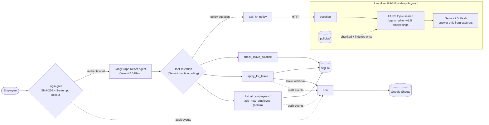

# HR Bot: Agentic HR Assistant with RAG

A command-line HR assistant built on a **LangGraph** agent running **Gemini 2.5 Flash**.
After a hashed-password login, employees ask questions in plain English. The agent calls
a tool for each one. Policy questions go to a **RAG pipeline in Langflow**: it retrieves
the relevant handbook passages with local embeddings and FAISS, and Gemini answers from
those passages only. Leave and admin requests use **SQLite**. Leave applications and
audit events go to self-hosted **n8n** webhooks, which append rows to **Google Sheets**.
Everything runs with **Docker Compose**.

## Architecture



## How routing works

`bot.py` builds the agent with LangGraph's prebuilt `create_react_agent`. It's a graph
with an LLM node and a tool node that loops until the model stops calling tools. The
graph state is the message history. On each turn Gemini sees the tool schemas (built from
each `@tool` function's signature and docstring) and a system prompt that maps intents
to tools: policy → `ask_hr_policy`, leave → `apply_for_leave`, and so on. Gemini then
decides with **function calling**:

- **RAG path:** questions about rules, benefits or policies call `ask_hr_policy`, which
  sends the question to the Langflow flow over HTTP.
- **Action path:** balance, leave and admin requests call tools that read or write
  SQLite and notify n8n.
- **Follow-ups:** if a required argument is missing (e.g. the number of leave days), the
  prompt tells the agent to ask for it instead of guessing. The full message history is
  passed back in on every turn.

The logged-in username goes into the system prompt, so the agent fills it in for balance
and leave requests without asking.

## How hallucination is limited

- **Retrieval, not memory.** Policy answers come only from `ask_hr_policy`. The Langflow
  flow splits `policies/` into 500-character chunks (100 overlap), embeds them locally
  with `BAAI/bge-small-en-v1.5`, and retrieves the **4 most similar chunks** from a FAISS
  index for each question.
- **A grounded prompt.** The generation prompt tells Gemini to answer *only* from those
  excerpts, to quote numbers and conditions exactly, to cite the policy section, and to
  reply exactly *"I couldn't find that in the HR policy documents."* when the excerpts
  don't contain the answer. For example, "Does the company offer a gym membership?" gets
  that reply instead of a made-up perk.
- **Temperature 0** for both the agent and the RAG generator.
- **The agent prompt** says "Never invent data. Only use tool results". Balances and
  employee lists come straight from SQLite.

## Tools

| Tool | What it does |
|---|---|
| `ask_hr_policy` | Sends the question to the Langflow RAG flow and returns the grounded answer. |
| `check_leave_balance` | Reads an employee's remaining leave days from SQLite. |
| `apply_for_leave` | Checks the balance, POSTs the request to the n8n leave webhook, and deducts the days in SQLite only if n8n accepts it. |
| `list_all_employees` | Admin only (needs the admin password): lists every employee and their balance. |
| `add_new_employee` | Admin only: creates an employee with a SHA-256-hashed password and 15 leave days. |

## Security

- **Hashed passwords:** stored as SHA-256 hex digests in SQLite and compared on login.
  Plaintext passwords are never stored.
- **3-attempt lockout:** three failed logins in a row lock that account for
  `LOCKOUT_MINUTES` (default 15). The lock is kept in SQLite (`failed_attempts`,
  `locked_until`), so restarting the bot doesn't reset it. Lockouts are audit-logged.
- **Secrets via environment:** all keys, passwords and URLs come from `.env` (see
  `.env.example`). `.env`, `secrets/` and database files are gitignored and kept out of
  Docker build contexts. The Langflow flow references `GOOGLE_API_KEY` by name, and
  Langflow reads it from the environment.
- **Known limits:** SHA-256 is unsalted (bcrypt or argon2 would be stronger), and
  `check_leave_balance` / `apply_for_leave` rely on the system prompt, not code, to use
  the logged-in username.

## Quickstart

Needs Docker and a Gemini API key from https://aistudio.google.com/apikey.

```bash
git clone https://github.com/PranshavShelat/HR_Bot.git
cd HR_Bot
cp .env.example .env     # fill in GOOGLE_API_KEY, passwords and a random LANGFLOW_API_KEY
docker compose up -d --build        # Langflow (RAG) + n8n
docker compose run --rm agent       # chat with the agent in your terminal
```

Log in with `admin` / `ADMIN_PASSWORD` or a user from `SEED_USERS`, then try:

- *How many sick days do I get?* (RAG)
- *What is my leave balance?*
- *Apply for 2 days of leave for a family wedding.*

The agent is an interactive CLI, so it runs with `docker compose run` rather than `up`.
The SQLite database lives on the `hr_data` volume and survives `docker compose down`
(`down -v` deletes it).

**Optional: Google Sheets logging.** Follow [docs/google-sheets-setup.md](docs/google-sheets-setup.md),
put the key at `secrets/google-service-account.json`, set `GOOGLE_SHEET_ID`, and run
`docker compose up -d`. Without it everything still works, and n8n just doesn't write rows.

**UIs:** Langflow at http://localhost:7860 (log in with `LANGFLOW_SUPERUSER`) shows the
RAG flow. n8n at http://localhost:5678 shows the workflows and executions.

**Changing the policy documents:** add or edit `.txt`/`.md` files in `policies/`,
delete the saved index with `docker compose exec langflow rm -rf /app/langflow-data/faiss_index`,
and the next question rebuilds it.

## Project layout

| Path | What it is |
|---|---|
| `bot.py` | Login gate, tools, LangGraph agent and CLI loop. |
| `langflow/flows/hr_policy_rag.json` | The RAG flow, auto-loaded by Langflow at startup. |
| `langflow/components/embeddings/local_hf_embeddings.py` | Custom Langflow component for local sentence-transformers embeddings. |
| `langflow/Dockerfile` | Langflow image with sentence-transformers and the embedding model baked in. |
| `n8n/workflows/*.json` | Leave and audit-log webhook workflows (webhook → Google Sheets). |
| `n8n/entrypoint.sh` | Imports and publishes the workflows and the Sheets credential when n8n starts. |
| `policies/` | HR policy documents the RAG flow retrieves from. |
| `Dockerfile`, `docker-compose.yml` | The agent image and the three-service stack. |

## Tech stack

Python 3.12 · LangGraph · LangChain · Gemini 2.5 Flash · Langflow 1.9 ·
sentence-transformers (`BAAI/bge-small-en-v1.5`) · FAISS · n8n (self-hosted) ·
Google Sheets · SQLite · Docker Compose
