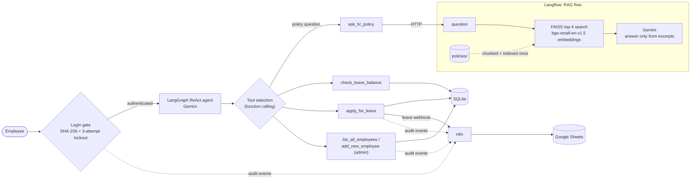

# HR Bot: Agentic HR Assistant with RAG


An HR assistant that answers policy questions **from the handbook, not from the model's
memory**, and carries out HR actions for the logged-in employee.

A **LangGraph** agent on **Gemini 2.5 Flash / 3.6 Flash** sends each message to the right tool.
Policy questions go to a **RAG pipeline in Langflow**: local embeddings and FAISS find the
relevant handbook passages, and Gemini answers from those passages only. Leave and admin
requests read and write **SQLite**, and every action is sent to **n8n** webhooks that
append rows to a **Google Sheets** audit log. Access is behind a **SHA-256 login with a
3-attempt lockout**, and the whole system runs as three containers with **Docker Compose**.

---

## Demo

Output from test runs against the Docker stack, lightly trimmed. The `[TOOL]` lines are the
agent's own trace of which tool it picked.

```text
Username: pranshav
Password: ********
✅ Welcome, pranshav!

You: How many sick days do I get, and when do I need a medical certificate?
[TOOL] ask_hr_policy → 'How many sick days do employees get and when is a medical certificate required?'
Bot: Employees receive 10 days of paid sick leave per year. A medical certificate is
     required for absences exceeding 3 consecutive days. (Source: 3. Leave & Time Off)

You: Does the company offer a gym membership?
[TOOL] ask_hr_policy → 'Does the company offer a gym membership?'
Bot: I couldn't find that in the HR policy documents.

You: What is my leave balance?
[TOOL] check_leave_balance → 'pranshav'
Bot: You have 15 leave days remaining.

You: Apply for 2 days of leave for a family wedding
[TOOL] apply_for_leave → pranshav, 2 day(s), reason='family wedding'
Bot: Your leave application for 2 days for 'family wedding' has been submitted.
     You have 13 leave days remaining.
```

Three failed logins lock the account, and restarting the bot doesn't reset the lock:

```text
❌ Incorrect username or password. 2 attempt(s) left.
❌ Incorrect username or password. 1 attempt(s) left.
🔒 Too many failed attempts. 'alice' is locked for 15 minutes.
```

---

## Architecture



| Container | Role | Reached at |
|---|---|---|
| `agent` | Login gate, LangGraph agent, tools, SQLite (on a named volume) | interactive terminal |
| `langflow` | RAG pipeline: local embeddings, FAISS retrieval, Gemini generation | `http://langflow:7860` |
| `n8n` | Leave and audit-log webhooks that write to Google Sheets | `http://n8n:5678` |

---

## How it works

### Routing: tool call or RAG
The agent is LangGraph's `create_react_agent`, a graph that cycles between a **model node**
and a **tool node** until the model gives a final answer. Its state is the message history.
On each turn Gemini sees every tool's name, arguments and docstring, along with a system
prompt that maps intents to tools, and then picks one by **function calling**:

- **Policy, rules or benefits** → `ask_hr_policy` sends the question to the Langflow RAG flow.
- **Personal actions** → `check_leave_balance` / `apply_for_leave` use SQLite and n8n.
- **Admin actions** → `list_all_employees` / `add_new_employee`, gated by the admin password.
- **Missing details** (e.g. how many days): the agent asks a follow-up instead of guessing.
  The full history is passed back in on every turn, so multi-step requests work.

The logged-in username goes into the system prompt, so the agent fills it in for the
employee's own balance and leave requests without asking.

### Grounding: keeping policy answers tied to the handbook
1. **Retrieval.** `policies/` is split into 500-character chunks (100 overlap), embedded
   locally with `BAAI/bge-small-en-v1.5` (sentence-transformers, no API), and indexed in
   FAISS. Each question retrieves the **top 4 chunks**.
2. **A grounded prompt.** Gemini must answer *only* from those excerpts, quote numbers and
   conditions exactly, and cite the policy section. If the excerpts don't contain the
   answer, it must reply *"I couldn't find that in the HR policy documents."* (see the
   gym-membership example in the demo).
3. **Temperature 0** for both the agent and the RAG generator.
4. **Agent prompt:** "Never invent data. Only use tool results." Balances and rosters come
   straight from SQLite.

### Tools
| Tool | What it does |
|---|---|
| `ask_hr_policy` | Queries the Langflow RAG flow and returns the grounded, cited answer. |
| `check_leave_balance` | Reads the employee's remaining leave days from SQLite. |
| `apply_for_leave` | Checks the balance, POSTs to the n8n leave webhook, and deducts the days only after n8n accepts it. |
| `list_all_employees` | Admin: lists every employee and their balance. |
| `add_new_employee` | Admin: creates an employee with a SHA-256-hashed password and 15 leave days. |

### Security
- **Hashed passwords:** SHA-256 digests in SQLite; plaintext is never stored.
- **3-attempt lockout:** three failed logins in a row lock the account for
  `LOCKOUT_MINUTES` (default 15). The lock is kept in SQLite (`failed_attempts`,
  `locked_until`), so it survives restarts. Lockouts are written to the audit log.
- **Secrets via environment:** all keys, passwords and URLs come from `.env`
  ([`.env.example`](.env.example) documents every variable). `.env`, `secrets/` and
  databases are gitignored and excluded from Docker build contexts. The Langflow flow
  refers to the Gemini key by variable name, so no key is ever saved in the flow export.

---

## Engineering decisions

| Decision | Why |
|---|---|
| **Local embeddings** (custom Langflow component) | Embedding needs no API key, adds no per-query cost, and can't hit a rate limit. The model is downloaded when the image is built, so the container needs no internet for it at runtime. |
| **FAISS index saved to a volume** | Chunks are embedded once and reused on later queries instead of being re-embedded every time. |
| **Flow auto-loaded with a fixed endpoint** | Langflow imports `hr_policy_rag.json` at startup under the endpoint `hr-policy-rag`, with the API key checked against the environment. `docker compose up` needs no manual steps in the UI. |
| **One `GEMINI_MODEL` for the agent and the RAG flow** | `bot.py` passes the model to the flow on every request, so switching models is a one-line `.env` change and the two never drift apart. |
| **Deduct leave only after n8n accepts it** | The database never records leave that the workflow didn't receive. |
| **Webhooks respond immediately** | A Google Sheets outage can't block a leave application; n8n writes the row asynchronously. |
| **Self-hosted n8n with setup at startup** | `n8n/entrypoint.sh` imports the workflows and the Sheets credential, then publishes the workflows on every start. It needs no n8n account or subscription. |
| **Lockout stored in the database** | A counter kept only in memory would reset on every restart. |
| **Dependencies installed before the source is copied** | Docker reuses the dependency layer, so a code change rebuilds in seconds. The agent runs as a non-root user. |

---

## How to run

Requires Docker and a Gemini API key ([get one here](https://aistudio.google.com/apikey)).

```bash
git clone https://github.com/PranshavShelat/HR_Bot.git
cd HR_Bot
cp .env.example .env              # add GOOGLE_API_KEY, passwords and a random LANGFLOW_API_KEY
docker compose up -d --build      # starts Langflow (RAG) and n8n
docker compose run --rm agent     # chat with the agent in your terminal
```

Log in as `admin` or a user from `SEED_USERS`, then try the questions from the demo.

- The agent is an interactive CLI, so it runs with `docker compose run` rather than `up`.
- SQLite lives on the `hr_data` volume and survives `docker compose down`; `down -v` resets it.
- **Web UIs:** Langflow at http://localhost:7860 (the RAG flow) and n8n at http://localhost:5678 (workflows and executions).
- **Google Sheets logging (optional):** follow [docs/google-sheets-setup.md](docs/google-sheets-setup.md). Without it everything still works; n8n just doesn't write rows.
- **Updating the policy documents:** edit `policies/`, then run
  `docker compose exec langflow rm -rf /app/langflow-data/faiss_index`. The index is rebuilt on the next question.

---

## Project structure

```text
HR_Bot/
├── bot.py                           # login gate, tools, LangGraph agent, CLI loop
├── requirements.txt                 # pinned agent dependencies
├── Dockerfile                       # agent image (python:3.12-slim, non-root)
├── docker-compose.yml               # agent + langflow + n8n, volumes, healthchecks
├── .env.example                     # every configuration variable, documented
├── policies/                        # HR documents the RAG flow retrieves from
├── langflow/
│   ├── Dockerfile                   # Langflow + sentence-transformers + baked-in model
│   ├── flows/hr_policy_rag.json     # the RAG flow, auto-loaded at startup
│   └── components/embeddings/       # custom local-embeddings component
├── n8n/
│   ├── entrypoint.sh                # imports credential + workflows, publishes, starts n8n
│   ├── make-credential.js           # service-account key → n8n credential
│   └── workflows/                   # leave-request and audit-log workflows
└── docs/google-sheets-setup.md      # service account + sheet setup
```

---

## Known limitations and next steps

- **Password hashing:** SHA-256 without a salt is fast to brute-force. A production
  version would use bcrypt or argon2.
- **Tool scoping:** the balance and leave tools use the logged-in username because the
  system prompt says so, not because the code enforces it. The next step is to bind the
  user into the tools server-side.
- **Index refresh:** changing the policy documents requires deleting the FAISS index by
  hand. A content hash could trigger re-indexing automatically.
- **Interface:** the agent is a terminal app. A small HTTP API would let it back a web UI
  or a Slack bot.

## Tech stack

Python 3.12 · LangGraph · LangChain · Gemini 2.5 Flash / 3.6 Flash (set via `GEMINI_MODEL`) ·
Langflow 1.9 · sentence-transformers (`BAAI/bge-small-en-v1.5`) · FAISS · n8n (self-hosted) ·
Google Sheets · SQLite · Docker Compose
